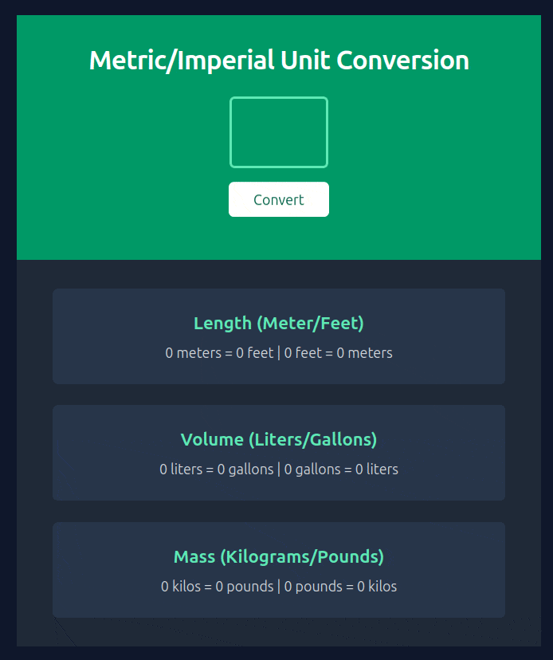

# web_learn

Repo where I practice web development. Projects come from [Scrimba](https://scrimba.com/the-frontend-developer-career-path-c0j).

## Password Generator

Simple password generator that utilizes simple Javascript.

## Metric / Imperial Converter

A two-way metric / imperial unit converter.
